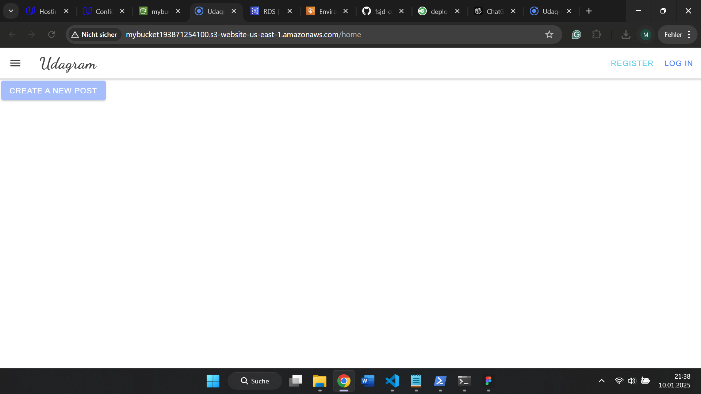
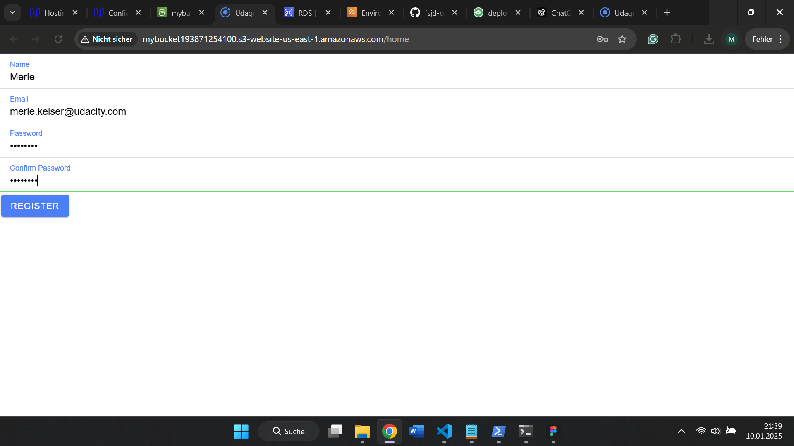
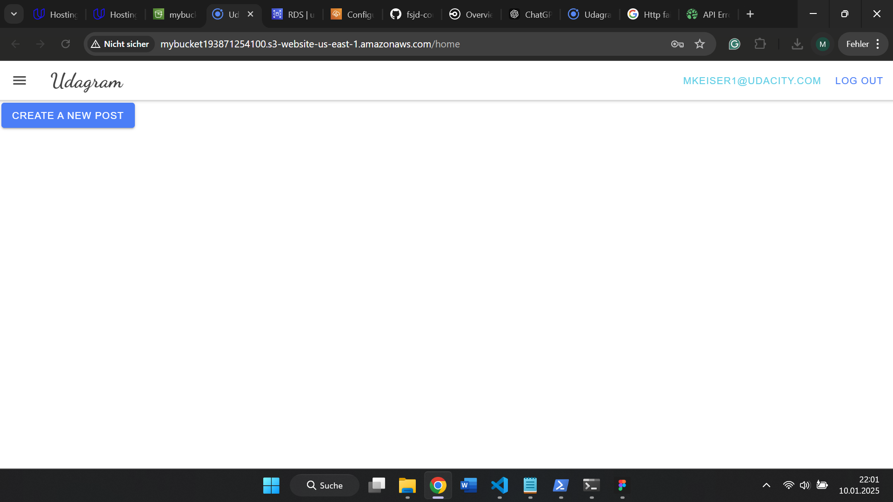
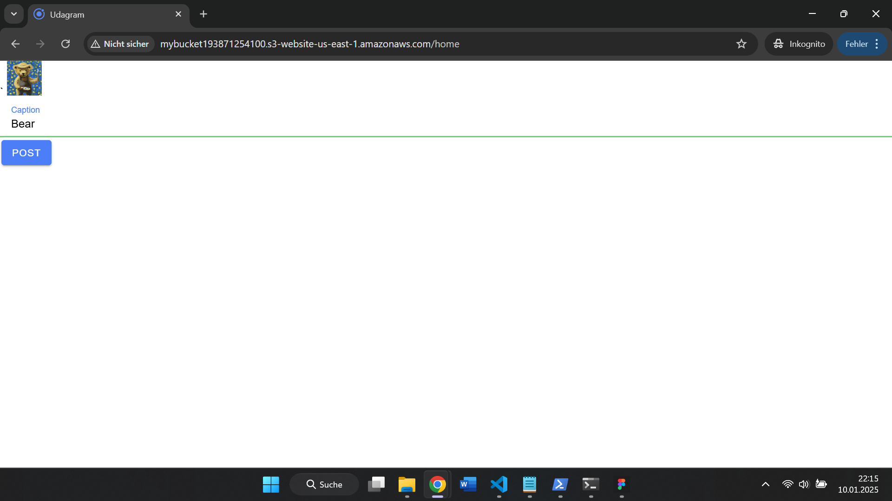

# Final exercise for Udacity Course 5 - Deployment Process

This project uses the Udagram starter code and was updated to Node 18.20.5. It makes use of Amazon RDS as a Postgres DB, Elastic Beanstalk as a server, and a S3 Bucket to host the website.

## Screenshots

## Link to Application
[Click here](http://mybucket193871254100.s3-website-us-east-1.amazonaws.com)
